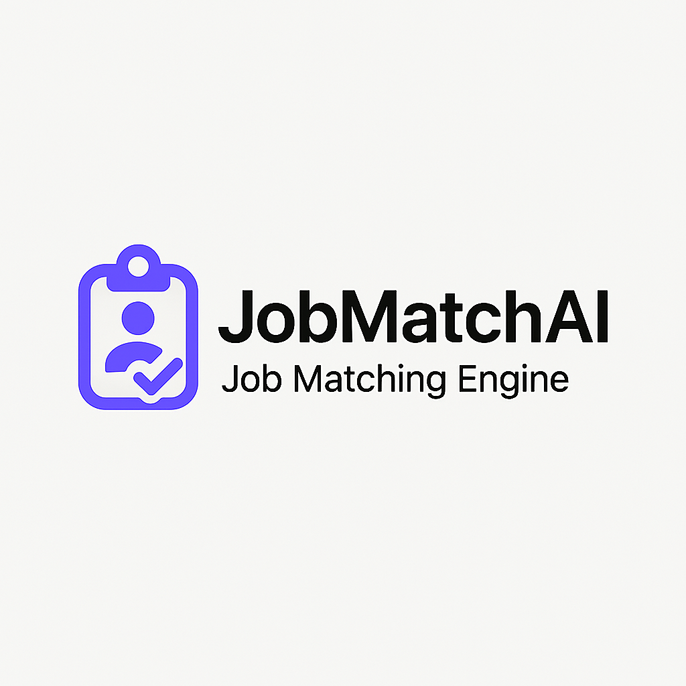
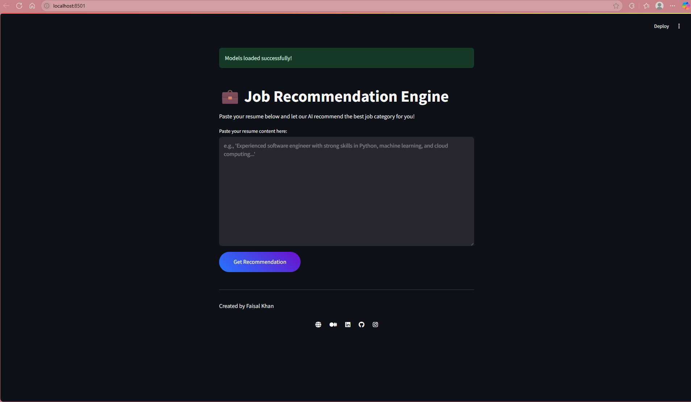
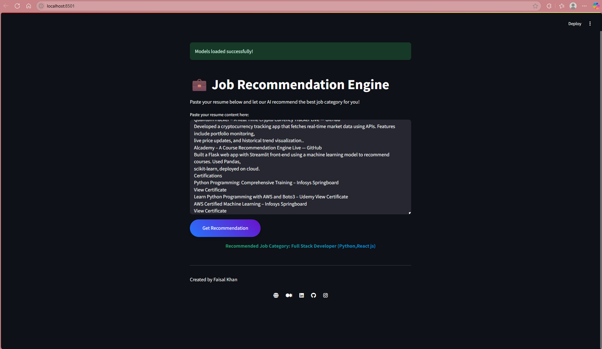

# 🤖 JobMatchAI — Smart Job Recommendation Engine with Streamlit & ML



**JobMatchAI** is a machine learning-powered web app that recommends job categories based on resume content. Built with **Streamlit**, it features a clean UI, responsive layout, and fast predictions using a trained model.

---

## 🌟 Features

- 📝 **Resume Text Input**: Paste your resume to get smart job recommendations.
- 🤖 **AI-Powered Prediction**: Uses TF-IDF + Logistic Regression for job classification.
- 🎨 **Modern Interface**: Bootstrap-based, vibrant and minimal UI.
- ⚡ **Fast Response**: Lightweight Streamlit backend ensures quick predictions.
- 🔗 **Social Footer**: Connect via social media from the app's footer.

---

## 🛠️ Tech Stack

**Backend**:
- Python
- Streamlit
- Scikit-learn
- NLTK
- Joblib

**Frontend**:
- HTML5, CSS3, Bootstrap 5
- JavaScript (Fetch API)
- Font Awesome, Google Fonts (Inter)

**Development Tools**:
- Google Colab (Model Training)
- Git & GitHub

---

## 📁 Project Structure

```
job_recommender/
├── app.py
├── requirements.txt
├── model/
│   ├── tfidf_vectorizer.joblib
│   ├── job_classifier.joblib
│   └── job_categories.joblib
└── README.md
```

---

## 🚀 Getting Started

```bash
git clone https://github.com/khanfaisal79960/JobMatchAI.git
cd JobMatchAI
python -m venv venv
source venv/bin/activate  # or .\venv\Scripts\activate on Windows
pip install -r requirements.txt
streamlit run app.py
```

Open your browser at: [http://127.0.0.1:5000](http://127.0.0.1:5000)

---

| Home Page | Recommendations |
|-----------|-----------------|
|  |  |

---

## 🧠 Model Training (Google Colab)

1. Upload `resume_data.csv` to Colab.
2. Run the Colab training script to:
   - Download NLTK resources.
   - Train TF-IDF + Logistic Regression.
   - Export `.joblib` files for vectorizer, classifier, and job categories.
3. Download and move them into the `model/` directory.

---

## 💡 Usage Guide

- Paste your resume into the form.
- Click "Get Recommendation".
- The predicted job category appears below the form.

---

## 🤝 Contributing

Feel free to fork this repository, open issues, or submit pull requests. Contributions are welcome!

---

## 🙋‍♂️ Author

**Faisal Khan**  
- 🌐 [Portfolio](https://khanfaisal.netlify.app)  
- 💼 [LinkedIn](https://www.linkedin.com/in/khanfaisal79960)  
- ✍️ [Medium](https://medium.com/@khanfaisal79960)  
- 📸 [Instagram](https://instagram.com/mr._perfect_1004)  
- 💻 [GitHub](https://github.com/khanfaisal79960)  

---